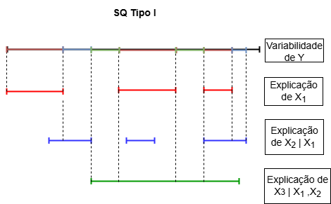
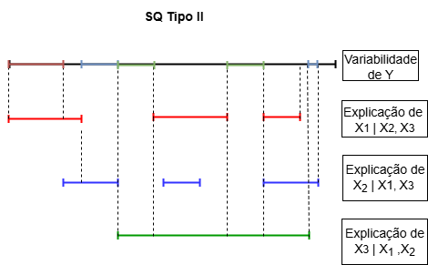

::: {.chapterintro data-latex=""}
Vamos iniciar essa aula pelo teste F global da ANOVA e pelo teste t que avalia a contribuição de cada parâmetro do modelo. Na sequência, discutiremos sobre a contribuição de variáveis explicativas em um MRLM, o que pode ser visto como um problema de comparação de modelos. Nesse contexto, será importante apresentar o conceito de redução de somas de quadrados (SQ) e apresentar os dois tipos de SQ adotadas na análise de modelos de regressão linear: a sequencial (tipo I) e a parcial (tipo II).

Essa aula é baseada, principalmente, no capítulo 3 da [Apostila de Recursos Computacionais utilizando o R](https://des.ufla.br/~danielff/meusarquivospdf/RRC0.pdf) (Ferreira, 2013), no capítulo 8 de Charnet et al. (2008) e no capítulo 7 de Kutner et al. (2004).
:::

## Testes relacionados aos coeficientes de um MRL

Vimos que uma tabela de Análise de Variância (ANOVA) resume quantidades que decorrem da partição da soma de quadrados total (SQ) e graus de liberdade associados à variável resposta $Y$. Em um primeiro momento, usamos essas quantidades para testar a significância geral do MRL, ou seja, para saber e há uma regressão entre a resposta $Y$ e o conjunto de variáveis expicativas $X$.


### O teste F global

O **teste F global** da ANOVA avalia se todos os $\beta_{j} =0$, ou seja,

$$
\left\{ 
\begin{array}{l}
H_0: \beta_1 = \beta_2 = \ldots = \beta_k = 0 \\
H_a: \beta_j \ne 0 \mbox{, para pelo menos um } j \mbox{, com } j = 1,2, \ldots, k
\end{array} \right.
$$

e a estatística teste é

$$
F_c = \dfrac{QMReg}{QMErro} 
$$

que, sob $H_{0}$, segue uma distribuição $F(\nu_1 = k; \nu_2 = n-k-1)$. Grandes valores de $F_{c}$ levam à rejeição de $H_{0}$ a favor de $H_{a}$. 


### Teste para um $\beta_{j}$ individual

Especialmente em regressão linear múltipla, podemos estar interessados em verificar se a contribuição de uma particular regressora, $X_j$, $j = 1, 2, 3, \dots, k$, é significativa ou não$^1$.

:::aside
$^1$ p. 185, Charnet et al. (2008)
:::

A contribuição de $X_j$ no MRLM é verificada através do teste das seguintes hipóteses:

$$
H_0 : \beta_j = 0 \\ \qquad
H_a : \beta_j \neq 0
$$

A estatística$^2$ para testarmos as hipóteses acima é

$$
T_{\beta_j} = \frac{\hat{\beta}_j}{\sqrt{\widehat{\sigma^2} C_{j+1, j+1}}}
$$

a qual, sob $H_0$, tem distribuição $t_{(n-k-1)}$:


::: aside
$^2$ A estatística é a quantidade pivotal vista na aula de estimação (_Estimação em Modelos de Regressão Linear_). Essa quantidade também foi usada na definição de intervalos de confiaça para $\beta_j$.

$$
\frac{\hat{\beta}_j - \beta_j}{\left( \widehat{\sigma^2} C_{j+1,j+1} 
\right)^{1/2}} \sim t_{(n-k-1)}
$$
:::

Na estatística, $C_{j+1,j+1}$ é o $(j+1)$-ésimo elemento da diagonal principal de $(\mathbf{X'X})^{-1}$. O Quadrado Médio do Erro (QME) obtido no ajuste de um MRL e disposto na ANOVA é um estimador de $\sigma^{2}$, ou seja, é $\widehat{\sigma^2}$. 


Portanto, para um nível de significância $\alpha$, rejeitamos a hipótese de que a contribuição da regressora não é significativa ($H_0$), se

$$
|T_{\beta_j}| \geq t_{\left(\frac{\alpha}{2}, n-k-1\right)}.
$$


Alternativamente, usando o resultado de que a distribuição do quadrado de variável aleatória com distribuição t de Student com $n$ graus de liberdade é uma variável com distribuição F com 1 e $n$ graus de liberdade, rejeitamos $H_0$, se

$$
T_{\beta_j}^2 \geq F_{1,(n-k-1)}(\alpha),
$$

sendo $F_{1,(n-k-1)}(\alpha)$ o quantil $(1 - \alpha)$ de distribuição F com 1 e $(n - k - 1)$ graus de liberdade.


Esse é um **teste F parcial** para verificar se um coeficiente de regressão $\beta_{j}$ em particular é igual a 0. Como ambos os testes t e F são equivalentes, a escolha é feita com base na disponibilidade da informação fornecida pelo recurso computacional utilizado (pelo _output_ do comando ou pacote).


## Reduções nas somas de quadrados e comparação de modelos

O teste da contribuição de uma variável regressora visto na seção anterior corresponde, na essência, a uma comparação entre dois modelos: um **modelo completo**, correpondendo ao modelo com todos os parâmetros, e um **modelo reduzido**. 

Por exemplo:

- Na descrição de uma relação entre duas variáveis em uma situação particular, devemos escolher uma reta ou uma parábola?  


$$
Y = \beta_0 + \beta_1 x + \varepsilon
$$

ou  

$$
Y = \beta_0 + \beta_1 x + \beta_2 x^2 + \varepsilon \, ?
$$


Ao comparar o modelo completo com um reduzido estamos avaliando se vale a pena acrescentar termos extras na parte sistemática do modelo. Sempre que fazemos isso, aumentamos a $SQReg$ e diminuímos a $SQErro$, mas resta saber se tal aumento (ou redução) é significativa. Em outras palavras, precisamos verificar se os termos extras contribuem para a melhor descrição da variável $Y$. Caso contrário, por parcimônia, devemos optar pelo modelo reduzido. 

::: aside
p. 186 e 187, Charnet et al. (2008)
:::


::: {.important data-latex=""}
Uma soma de quadrados extra mede a redução na soma de quadrados do erro ($SQErro$) quando uma ou mais variáveis são adicionadas ao modelo de regressão, dado que outras variáveis já estão no modelo. De forma equivalente, podemos ver uma soma de quadrados extra como o aumento na soma de quadrados da regressão ($SQReg$) quando uma ou mais variáveis explicativas são adicionadas ao modelo de regressão (Kutner et al., 2004).

Considere um MRL para descrever $Y$ em função de duas variáveis expicativas, $X_{1}$ e $X_{2}$. Esses autores utilizam a notação $SSR(X_{2}|X_{1})$ para denotar a _soma de quadrados extra_, calculada por $SSE(X_{1}) - SSE(X_{1}, X_{2})$. Nesse caso, $SSE(X_{1})$ é a $SQErro$ para o modelo que contém apenas a variável $X_{1}$ e $SSE(X_{1}, X_{2})$ é a $SQErro$ para o modelo que contém as variáveis $X_{1}$ e $X_{2}$.
:::

Então, temos aqui o problema de definir sub-modelos a partir do modelo completo com $(k+1)$ parâmetros. Para isso, podemos definir dois tipos de somas de quadrados: a sequencial (tipo I) e a parcial (tipo II). Para a apresentação desses conceitos, vamos utilizar o material de Ferreira (2013)$^3$ e adotar a sua notação. 

::: aside
$^3$ Ferreira, D. F. (2013) Recursos Computacionais Utilizando R. p. 68-87.
:::


**Soma de quadrados sequencial**

Consideremos um modelo com $k + 1$ parâmetros. Na soma de quadrados sequencial tomamos o modelo completo e o reduzimos eliminando a variável $k$. A soma de quadrados do modelo completo é representada por $R(\beta_{0}, \beta_{1}, \ldots, \beta_{k})$ e a do modelo reduzido é $R(\beta_{0}, \beta_{1}, \ldots, \beta_{k-1})$, cuja notação $R$ indica a redução particular do modelo que está sendo abordado. A diferença da soma de quadrados dos dois modelos é 

$$
R(\beta_{k} | \beta_{0}, \beta_{1}, \ldots, \beta_{k-1}) = R(\beta_{0}, \beta_{1}, \ldots, \beta_{k}) - R(\beta_{0}, \beta_{1}, \ldots, \beta_{k-1}).
$$
Se, do modelo com $k-1$ variáveis eliminarmos a última e repetirmos este procedimento, teremos a soma de quadrados da $(k-1)$-esima variável ajustada para todas as outras que a precedem. Se fizermos isso repetidas vezes até reduzirmos o modelo ao termo constante apenas, teremos as somas de quadrados de cada variável ajustada para todas as outras que a precedem, ignorando as variáveis que a sucedem. 


{fig-align="center"}

Nessa situação, para que a última variável a ser incluída seja considerada significativa, ela precisa fornecer uma explicação adicional sobre a variabilidade de $Y$ que não foi explicada por todas as variáveis anteriores.

::: {.tip data-latex=""} 
No R, a ANOVA obtida pelo comando `stats::anova` contém as somas de quadrados do tipo sequencial. Por essa razão, os testes t para as contribuições individuais dos $\beta_{j}$ obtidos no `summary()` podem ser incoerentes com os resultados pelo comando `anova()`. Esses testes t são equivalentes aos testes F da ANOVA com as somas de quadrados parciais.
:::


**Soma de quadrados parcial**

Para obtermos as somas de quadrados parciais ou do tipo II, partimos do modelo completo e formamos um novo modelo eliminando uma das variáveis. A soma de quadrados do modelo reduzido é comparada com a soma de quadrado do modelo completo e a sua diferença é a soma de quadrados
do tipo II. Assim, temos o ajuste de cada variável para todas as outras do modelo. A soma de quadrados na redução refere-se ao que a variável em questão acrescentou de explição sobre a variabilidade de $Y$ que não está sendo explicado simultaneamente por todas as outras variáveis, conforme representado na Figura a seguir.


{fig-align="center"}

::: {.tip data-latex=""} 
No R, a ANOVA com somas de quadrados parciais (tipo II) pode ser obtida pelo comando `car::Anova`. Os quadrados das estatísticas calculadas para os testes t para as contribuições individuais dos $\beta_{j}$ obtidos no `summary()` equivalem aos testes F dos $\beta_{j}$ da ANOVA parcial. 
:::

A Tabela a seguir foi adaptada de Ferreira (2013) e resume bem os tipos de somas de quadrados de um modelo de regressão contendo $k$ variáveis.


| FV  | SQ Tipo I | SQ Tipo II |
|-----|-----------|------------|
| $X_{1}$  | $R(\beta_{1} | \beta_{0})$         | $R(\beta_{1} | \beta_{0}, \beta_{2}, \ldots, \beta_{k})$          |
| $X_{2}$  | $R(\beta_{2} | \beta_{0}, \beta_{1})$         | $R(\beta_{2} | \beta_{0}, \beta_{1}, \ldots, \beta_{k})$          |
| $\vdots$ | $\vdots$       | $\vdots$        |
| $X_{k}$  | $R(\beta_{k} | \beta_{0}, \beta_{1}, \ldots, \beta_{k-1})$         | $R(\beta_{k} | \beta_{0}, \beta_{1}, \ldots, \beta_{k-1})$          |


::: {.tip data-latex=""} 
As somas de quadrados tipo I e tipo II da $k$-ésima variável são iguais. 
:::

Uma forma simples de obter as somas de quadrados do tipo II é baseada no método da inversa de parte da inversa (Searle, 1971 e 1987). Esse método permite a obtenças dessas somas de quadrados sem que seja necessário fazer a redução de modelos. Para a variável $X_{j}$, a soma de quadrados parcial pode ser calculada por:

$$
R(\beta_{j} | \beta_{0}, \ldots \beta_{j-1}, \beta_{j+1}, \ldots, \beta_{k}) = \frac{\hat\beta^2_{j}}{C_{j+1, j+1}},
$$
em que $C_{j+1, j+1}$ é o $(j+1)$-ésimo elemento da diagonal principal de $(\mathbf{X'X})^{-1}$. 


## Um exemplo de MRLM usando R

::: {.data data-latex=""}
(Adaptado de Kutner et al., 2004)

Os dados a seguir foram coletados em um estudo sobre a relação entre a quantidade de gordura corporal ($Y$) e várias possíveis variáveis explicativas, a partir de uma amostra de 20 mulheres saudáveis com idade entre 25 e 34 anos. As variáveis preditoras consideradas são espessura da prega cutânea do tríceps ($X_{1}$), circunferência da coxa ($X_{2}$) e circunferência do meio do braço ($X_{3}$). A gordura corporal para cada uma das 20 pessoas foi obtida por um procedimento caro e incômodo requerindo a imersão da pessoa na água. Então, seria muito útil se um modelo de regressão com algumas ou todas essas variáveis preditoras pudesse fornecer estimativas confiáveis da gordura corporal já que as medidas das preditoras são fáceis de obter.
:::


```{r,warning=FALSE,message = FALSE, echo=FALSE}
#library(downloadthis)
library(tidyverse)

dados <- read_csv("dados/gordura.csv")

#dados %>%
#    download_this(
#    output_name = "gordura",
#    output_extension = ".csv",
#    button_label = "Download dos dados",
#    button_type = "primary",
#    has_icon = TRUE,
#    icon = "fa fa-save"
#  )
```

### Modelos marginais

Inicialmente, vamos ajustar os modelos marginais, ou seja, cada um deles contém apenas uma das variáveis sozinhas. Por meio desses modelos tentamos explicar a variabilidade de $Y$ em função de uma variável preditora, ignorando a existência de outras. Vamos explicar com detalhes alguns resultados relacionados a $X_{1}$.

```{r,warning=FALSE,message = FALSE, echo=TRUE}
modelo.x1 <- lm(gordura ~ esp.triceps, data = dados)

summary(modelo.x1)
anova(modelo.x1)

modelo.x1
```

Observe que, na saída do comando `summary()` temos o teste t para o parâmetro associado a $X_{1}$, que podemos denotar por $\beta_{1}$. Nesse caso, como temos um MRLS, o quadrado da estatística $t$ calculada equivale ao teste $F$ global, cuja estatística foi igual a 44,30. O mesmo teste aparece no resultado do comando `anova()`, para o efeito da regressão.  

Veja que o modelo de regressão foi significativo quando consideramos a variável espessura da prega cutânea do tríceps ($X_{1}$), com as estimativas dos parâmetros $\hat\beta_{0} = -1,4961$ e $\hat\beta_{1} = 0,8572$. Na sequência, apresentamos os resultados dos modelos marginais para as outras duas variáveis, $X_{2}$ e $X_{3}$. A interpretação dos comandos é a mesma.

```{r,warning=FALSE,message = FALSE, echo=TRUE}
modelo.x2 <- lm(gordura ~ circ.coxa, data = dados)

summary(modelo.x2)
anova(modelo.x2)

modelo.x2
```

Ao considerar apenas a variável $X_{2}$ também encontramos um efeito significativo da regressão. Por outro lado, a variável $X_{3}$ (circunferência do meio do braço) parece não contribuir para explicar a variabilidade em $Y$, conforme resultados apresentados a seguir.


```{r,warning=FALSE,message = FALSE, echo=TRUE}
modelo.x3 <- lm(gordura ~ circ.braco, data = dados)

summary(modelo.x3)
anova(modelo.x3)

modelo.x3
```


### Modelos de Regressão Linear Múltipla

Agora, vamos obter um MRLM com as variáveis $X_{1}$ e $X_{2}$.

```{r,warning=FALSE,message = FALSE, echo=TRUE}
modelo.x1.x2 <- lm(gordura ~ esp.triceps + circ.coxa, data = dados)

summary(modelo.x1.x2)
anova(modelo.x1.x2) #tipo I

```

Pelos resultados dos testes t individuais, notamos que a contribuição individual de $X_{1}$ não é significativa. No entanto, quando essa variável é a primeira a ser considerada no modelo, sua contribuição é significativa, assim como a de $X_{2}$. A redução da SQ do erro com a inclusão da variável $X_{2}$ no modelo foi de 33,17 (385,44 - 352,27).   

Para obter a ANOVA com somas de quadrados do tipo II, vamos usar a função `Anova()` do pacote `car`.

```{r,warning=FALSE,message = FALSE, echo=TRUE}
library(car)
Anova(modelo.x1.x2) #tipo II
```

Finalmente, temos a seguir o modelo com as três variáveis explicativas. Mesmo tendo visto que marginalmente as variáveis $X_1$ e $X_2$ contribuem para a explicação sobre a variação de $Y$, os testes t foram não significativos para esse modelo. Isso quer dizer que, na presença das demais variáveis, nenhuma variável tem uma contribuição significativa.  


```{r,warning=FALSE,message = FALSE, echo=TRUE}
modelo.x1.x2.x3 <- lm(gordura ~ esp.triceps + circ.coxa + circ.braco, data = dados)

summary(modelo.x1.x2.x3)
anova(modelo.x1.x2.x3) #tipo I

```

Ao analisar a estrutura de correlação entre as variáveis, notamos uma alta correlação especialmente entre as variáveis $X_{1}$ e $X_{2}$, o que explica os resultados anteriores. Possivelmente, essas variáveis não necessitariam estar juntas no modelo.


```{r,warning=FALSE,message = FALSE, echo=TRUE}
cor(dados)
```

A ANOVA com somas de quadrados do tipo II também é apresentada a seguir. Os testes são equivalentes aos testes t discutidos anteriormente.

```{r,warning=FALSE,message = FALSE, echo=TRUE}
library(car)
Anova(modelo.x1.x2.x3) #tipo II

```


::: {.singlelab data-latex=""}
Considere o modelo para gordura corporal ($Y$) com as três variáveis preditoras. Faça um novo ajuste de um MRLM e, durante a especificação do modelo (comando `lm()`, por exemplo), considere uma ordem diferente de entrada das preditoras. Exemplo: `Y ~ X2 + X3 + X1`. Compare os resultados obtidos pelos dois tipos de somas de quadrados (tipo I e tipo II) e com aqueles obtidos na seção anterior.
:::


